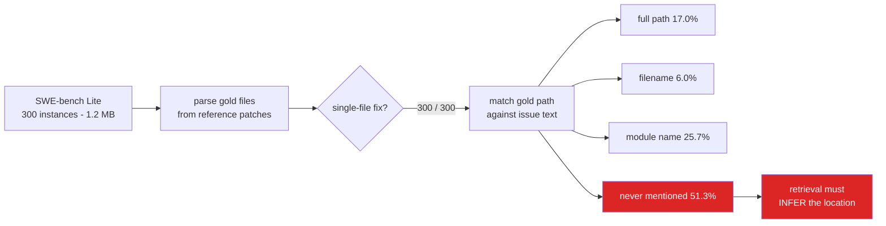

<h1 align="center">swebench-localization (Python · pandas · PyArrow · HuggingFace Datasets)</h1>
<p align="center"><i>Is the answer even in the question?</i></p>

<p align="center">
  <a href="docs/RESULTS.md">Phase 1 results</a> &middot;
  <a href="docs/RESULTS-PHASE2.md">Phase 2 results</a> &middot;
  <a href="docs/METHOD.md">Method</a> &middot;
  <a href="docs/PROBLEMS.md">Problems hit</a> &middot;
  <a href="docs/LIMITATIONS.md">Limitations</a> &middot;
  <a href="docs/FUTURE.md">Future work</a> &middot;
  <a href="#reproduce">Reproduce</a>
</p>

<p align="center">
  <a href="https://github.com/hammasbuilds/swebench-localization/actions/workflows/ci.yml"></a>
  <a href="LICENSE"></a>
  
  
  
  
  <a href="https://github.com/astral-sh/ruff"></a>
</p>

---

> ### 51.3% of SWE-bench Lite never names the file you have to fix.

SWE-bench is reported as **one number**. But solving an instance needs two different
things - **find the file**, then **write the patch** - and a single score cannot say which
one failed.

A model that fails on an issue that never names the file has not failed at *reasoning
about code*. It has failed at **search**. Those are different problems with different
fixes.

---

## The result

All 300 instances. Every one is a single-file fix, so localization is exactly *"rank the
one correct file first"*.

| How the gold file is referenced | Instances | Share |
|---|---:|---:|
| Full path, verbatim | 51 | 17.0% |
| Filename only | 18 | 6.0% |
| Module name only | 77 | 25.7% |
| **Never mentioned at all** | **154** | **51.3%** |

### Two more findings that fell out of it

**Hints change the task.** Including `hints_text` drops "never mentioned" from **51.3% to
38.0%** and doubles the full-path cases. Results using hints are not comparable to results
without them - and papers do not always say which they used.

**The aggregate score hides a repo effect.** Difficulty ranges from **astropy 16.7%** to
**sphinx 87.5%**, and `django/django` alone is 38% of the benchmark.

&#128202; **[Full tables, per-repo breakdown, and the hints comparison &rarr;](docs/RESULTS.md)**

---

## How it works



Matching is a strict ladder - full path, then basename, then a word-boundary regex on the
module stem - so each instance lands in exactly one tier and the strongest form present
wins.

&#128269; **[How the gold files and matching actually work &rarr;](docs/METHOD.md)**

---

## Phase 2: so can anything find the file?

Four retrievers, same 300 instances, same candidate set - every source file in the
repository. Scored as recall@10, cut by the Phase 1 tiers.

| Tier | n | BM25 | embeddings | 14B locator | 14B reranking BM25 |
|---|---:|---:|---:|---:|---:|
| `full_path` | 51 | 74.5% | 56.9% | **98.0%** | 86.3% |
| `stem_only` | 77 | 50.6% | 59.7% | **84.4%** | 70.1% |
| `not_mentioned` | 154 | **8.4%** | 29.2% | **55.8%** | 17.5% |

**BM25 falls from 74.5% to 8.4%.** On the half of the benchmark that never names the file,
lexical matching has nothing to match - so a single SWE-bench number largely rewards string
matching, and the other half is being graded on a retrieval failure.

### The model's advantage is knowing the codebase, not ranking it

The same 14B scores 55.8% on `not_mentioned` when it names files freely and 17.5% when it
may only reorder BM25's top-30. It is not a bad reranker - it realises **92.1%** of the
ceiling it is handed. The problem is the ceiling: on that tier **BM25's entire top-30
contains the answer just 23.4% of the time**, and the model naming files outright beats
that outright.

It also invents **20.9%** of the paths it names, which is why that is reported beside the
recall rather than under it.

[Full tables, the tuning sweep, and what was tested rather than assumed &rarr;](docs/RESULTS-PHASE2.md)

---

## Why this matters

A SWE-bench agent that scores badly is usually assumed to need a bigger model. This says:
**establish first how much of the failure was ever a retrieval problem.** For 154 of 300
instances, no amount of code reasoning helps until the right file has been found.

It also makes a model-size comparison far more informative - you can say **which half** the
bigger model improved.

---

## Reproduce

```bash
python src/data.py              # dataset integrity + gold file extraction
python src/mention_analysis.py  # every number in this README
pytest -q                       # 16 tests, no network, no dataset needed
```

Nothing is hard-coded. Every figure is recomputed from the same functions.

---

## Input


## Output


*Half the benchmark is a retrieval problem wearing a reasoning problem's clothes. When the
issue never names the file, a single pass@1 score cannot tell you whether the model reasoned
badly or was simply shown the wrong file — and a bigger model fed the wrong file still fails.*

---

## Also worth reading

| | |
|---|---|
| &#128202; **[Results](docs/RESULTS.md)** | Full tables, per-repo difficulty, hints comparison |
| &#128269; **[Method](docs/METHOD.md)** | Gold file extraction, the matching ladder, determinism |
| &#128736; **[Problems hit](docs/PROBLEMS.md)** | A hardcoded path, a broken CI cache, and an overcounting regex |
| &#9888; **[Limitations](docs/LIMITATIONS.md)** | What Phase 1 does and does not establish |
| &#128202; **[Phase 2 results](docs/RESULTS-PHASE2.md)** | Four retrievers scored as recall@k, cut by discoverability tier |
| &#128295; **[Phase 2 method](docs/PHASE2.md)** | Candidate sets, BM25 tuning, the two LLM arms |
| &#128640; **[Future work](docs/FUTURE.md)** | Patch validity, the memorisation test, full SWE-bench |

---

## Status

&#9989; **Phase 1 complete** - benchmark discoverability measured.

&#9989; **Phase 2 complete** - BM25, embeddings, an LLM locator and an LLM reranker scored
as recall@k. See [RESULTS-PHASE2.md](docs/RESULTS-PHASE2.md).

&#128308; **Phase 3 not started** - conditioning patch validity on localization, and testing
the memorisation hypothesis on repositories the model cannot have seen. See
[FUTURE.md](docs/FUTURE.md).

## Layout

```
src/data.py               load from HF cache, parse gold files from patches
src/mention_analysis.py   discoverability tiers + per-repo breakdown
src/trees.py              repository file listings via the Trees API, cached
src/retrieval.py          BM25, embeddings, LLM locator, LLM reranker
src/evaluate.py           recall@k by tier, fabrication rate, path resolution
run_phase2.py             Phase 2 driver, resumable per instance
tests/                    45 tests, no network, no dataset, no model
docs/                     detailed documentation
data/sources.json         provenance, counts, checksum
```

## Stack

`Python 3.11+` &middot; `pandas` &middot; `pyarrow` &middot; `Okapi BM25 (pure Python)`
&middot; `nomic-embed-text` &middot; `qwen2.5-coder:14b` via `Ollama`
&middot; `GitHub Trees API` &middot; `pytest` &middot; `ruff` &middot; `GitHub Actions`
&middot; dataset via `Hugging Face Hub`

## Keywords

SWE-bench &middot; SWE-bench Lite &middot; bug localization &middot; fault localization
&middot; code retrieval &middot; LLM benchmark &middot; benchmark evaluation &middot;
benchmark contamination &middot; retrieval vs reasoning &middot; automated program repair
&middot; issue-to-file mapping &middot; coding agent evaluation &middot; AI software
engineering &middot; LLM evaluation harness &middot; reproducible benchmarks &middot; BM25

## References

Jimenez, C. E., Yang, J., Wettig, A., Yao, S., Pei, K., Press, O., & Narasimhan, K.
**SWE-bench: Can Language Models Resolve Real-World GitHub Issues?** *ICLR 2024.*

&#9888; Citation written from the standard reference - confirm against the paper before
relying on it.

## Licence

MIT - see [LICENSE](LICENSE).
